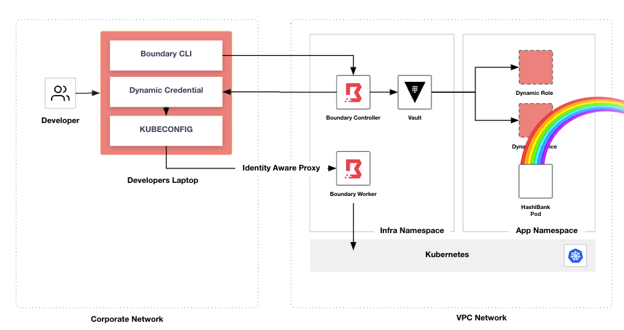

# Securing Access to Kubernetes with Boundary



## Summary
This repo deploys Boundary and Vault into a GKE Kubernetes cluster and configures them to demonstrate an example workflow where by a developer uses Boundary to request Just-In-Time access to their application namespace.

A Youtube video of me presenting this demo is available [here](https://www.youtube.com/watch?v=69UFSAIDQgM).


## Prerequisites
| Requirement | Version |
| - | - |
| GKE Cluster | 1.26.5 |
| gcloud CLI | 422.0.0 |
| Boundary Desktop Client | 1.6.0 |
| Boundary CLI | 0.13.0+ent |
| Terraform CLI | 1.5.1 |
| Helm CLI | 3.9.0 |
| Vault CLI| 1.12.0 |
| Boundary Enterprise Licence | - |

Although the code in this repo was written to work with the above requirements and version, there's no reason with a small amount of customization it wouldn't work on any Kubernetes distribution. The main change that you'd have to would be the [ingress](./deploy/ingress) objects.

Before you start, you need to be authenticated to the Kubernetes API. Confirm so by running this command.
```
kubectl get nodes
NAME                                       STATUS   ROLES    AGE   VERSION
gke-cluster-1-my-node-pool-f34728b6-9275   Ready    <none>   15m   v1.26.5-gke.1200
```

If the above command doesn't work, see [Authenticating to the Kubernetes API server](https://cloud.google.com/kubernetes-engine/docs/how-to/api-server-authentication).

## Deployment
<details> 
  <summary><b>Step 1 - Deploy Namespaces</b></summary>

---
Deploy 2 namespaces.
- app - Used by the example web app.
- infra - Used by Vault and Boundary.
```bash
sh demo.sh namespaces
```  

</details>

<details> 
  <summary><b>Step 2 - Deploy Ingress</b></summary>

---
Deploy Services for HashiBank and Vault. In GKE, we deploy Kubernetes Services of `type: LoadBalancer` which then provisions a Cloud Loadbalancer mapped to the Service.

Why do we create the service ingress objects separately here and not together with each app? Because requesting a public IP from Google takes a few minutes, setting them up early makes sure that they have a  public IP associated by the time we need them.
```bash
sh demo.sh ingress
```  

</details>


<details> 
  <summary><b>Step 3 - Deploy Vault</b></summary>

---
Using the official Helm chart, deploy a single node of Vault, running in dev mode.  
```
sh demo.sh vault
```  

</details>

<details> 
  <summary><b>Step 4 - Deploy Postgres</b></summary>

---
Using the Bitnami Helm chart, deploy a single instance of Postgresql.
```
sh demo.sh postgres
```  

</details>

<details> 
  <summary><b>Step 5 - Deploy Boundary License</b></summary>

---
Your Boundary license file needs to be exported in the environment variable `BOUNDARY_LICENSE`. If the env var is not set, the script will exit with an error.
```
export BOUNDARY_LICENSE=02MVENNEWU...
sh demo.sh boundary-license
```  

</details>

<details> 
  <summary><b>Step 6 - Deploy Boundary Controller</b></summary>

---

Deploy the Boundary Enterprise Controller.
```
sh demo.sh boundary-controller
```  

</details>

<details> 
  <summary><b>Step 7 - Save Boundary Worker Public IP Address</b></summary>

---

Store the public IP address from the Boundary worker's external service into a ConfigMap. We set this value as an env var in 
the worker container because the worker needs to know it's public IP address for establishing sessions. This command will fail if the external loadbalancer hasn't been assigned an IP address yet.
```
sh demo.sh boundary-worker-addr
```  

</details>

<details> 
  <summary><b>Step 8 - Deploy Boundary Worker</b></summary>

---

Deploy a single instance of Boundary PKI Worker with auth persistence, session recording storage cache and encryption.
```
sh demo.sh boundary-worker
```  

</details>

<details> 
  <summary><b>Step 9 - Register the Boundary Worker with the Boundary Controller</b></summary>

---

Register the Boundary Worker to the Boundary controller using the worker-led registration method.
```
sh demo.sh boundary-worker-register
```  

</details>

<details> 
  <summary><b>Step 10 - Configure Vault</b></summary>

---

Use Terraform to manage all of Vault's configuration as code.
```
sh demo.sh vault-config-init
sh demo.sh vault-config-plan
sh demo.sh vault-config-apply
```

</details>

<details> 
  <summary><b>Step 11 - Configure Boundary</b></summary>

---
Use Terraform to manage all of Boundary's configuration as code.    

```
sh demo.sh boundary-config-init
sh demo.sh boundary-config-plan
sh demo.sh boundary-config-apply
```  

</details>

## Operations
<details> 
  <summary><b>Accessing Vault and Boundarys UI</b></summary>

---
```
kubectl -n infra get svc
NAME                           TYPE           CLUSTER-IP      EXTERNAL-IP     PORT(S)                      AGE
boundary-controller-external   LoadBalancer   10.244.5.138    <external-ip>   80:30126/TCP                 44m
boundary-worker-external       LoadBalancer   10.244.15.157   <external-ip>   80:30668/TCP                 44m
vault-external                 LoadBalancer   10.244.13.132   <external-ip>   80:31234/TCP                 44m
```

</details>

<details> 
  <summary><b>Default Usernames and Passwords</b></summary>

---
| Component | Username | Password | Token | 
| - | - | - | - |
| Boundary | admin-user | password123 | - | 
| Vault | - | - | Hash!123 | 

</details>

<details> 
  <summary><b>Authenticate to Boundary</b></summary>

---
Output env vars to auth the Boundary CLI.
```
sh demo.sh boundary-auth
```  

</details>

<details> 
  <summary><b>Authenticate to Vault</b></summary>

---
Output env vars to auth the Vault CLI.
```
sh demo.sh vault-auth
```  

</details>

## Workflows

<details> 
  <summary><b>Developer logging in to Kubernetes via Boundary</b></summary>

---

Authenticate to Boundary.
```
sh demo.sh boundary-auth
BOUNDARY_ADDR set to http://x.x.x.x.x
BOUNDARY_AUTH_METHOD set to ampw_msTnsE7nJ2

Authentication information:
  Account ID:      acctpw_roAzBnLRBY
  Auth Method ID:  ampw_msTnsE7nJ2
  Expiration Time: Wed, 02 Aug 2023 17:59:36 AEST
  User ID:         u_5pFXn6rNSj

The token was successfully stored in the chosen keyring and is not displayed here.
Run the following command to use the Boundary CLI locally
export BOUNDARY_ADDR=http://x.x.x.x
```  
Copy and paste the export command to your CLI,.
```
export BOUNDARY_ADDR=http://x.x.x.x
```  

Find the target ID for our Kubernetes cluster.
```
boundary targets list -recursive

Target information:
  ID:                    ttcp_gshPlGwsct <-- HERE
    Scope ID:            p_BWY9lDC7R4
    Version:             3
    Type:                tcp
    Name:                Kubernetes Production
    Description:         Kubernetes Production Cluster
    Authorized Actions:
      no-op
      read
      update
      delete
      add-host-sources
      set-host-sources
      remove-host-sources
      add-credential-sources
      set-credential-sources
      remove-credential-sources
      authorize-session
```  

Run the `connect.sh` helper script to establish a session with Boundary and generate our `KUBECONFIG`.
```
sh deploy/kubeconfig/connect.sh ttcp_gshPlGwsct
Connecting to cluster My-Kubernetes-Cluster via Boundary Proxy 0:55578
```

You are now successfully authenticated as a developer using a dynamic service account that Vault has created on our behalf.

Let's deploy an application with our newly created access.
```
kubectl apply -f deploy/hashibank
```

Confirm that our HashiBank application has deployed sucessfully by browsing to the external IP on the service.
```
kubectl get svc
NAME                 TYPE           CLUSTER-IP     EXTERNAL-IP     PORT(S)        AGE
hashibank-external   LoadBalancer   10.244.7.230   y.y.y.y         80:30566/TCP   129m
```

Browse to http://y.y.y.y in your web browser.  


</details>
